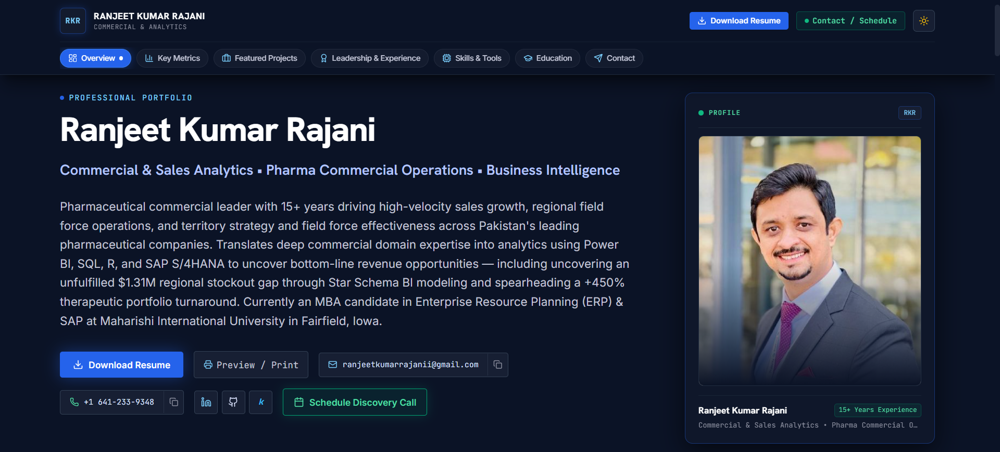

# Ranjeet Kumar Rajani — Portfolio

A recruiter-facing personal portfolio site presenting 15+ years of pharmaceutical commercial leadership through an analytics lens — commercial operations, sales analytics, and business intelligence.

**Live:** https://ranjeet-rajani.vercel.app/

## Preview



## Tech Stack

- **React 19** + **TypeScript** — component UI
- **Vite 8** — build tooling
- **Tailwind CSS 4** — styling
- **lucide-react** — icons
- **qrcode** — downloadable vCard QR contact card
- **motion** — animations

## Features

- Professional profile with audited KPI benchmarks (commercial tenure, turnaround execution, field force governance, data modeled)
- Project deep-dives: Pharma Commercial Analytics Command Center (Power BI), Cyclistic Bikeshare Behavioral Study (R/Tidyverse), SAP S/4HANA Procure-to-Pay implementation
- Leadership track record timeline
- Skills, education & certification sections
- Contact section with vCard QR code, resume download, and scheduling via email draft
- Continuous deployment via GitHub → Vercel

## Getting Started

```bash
npm install
npm run dev      # start local dev server
npm run build    # production build
```

## Project Structure

```
src/
├── components/   # page sections (Hero, Projects, Experience, Contact, ...)
├── data/         # portfolio content (portfolioData.ts)
└── utils/        # analytics, socials helpers
public/
├── ranjeet-headshot.jpg
└── Ranjeet_Kumar_Rajani_Resume.pdf
```

## License

MIT
